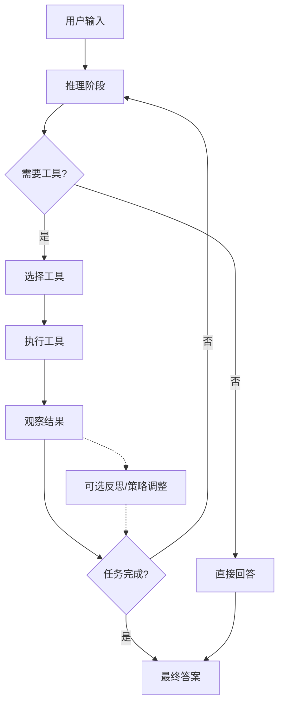
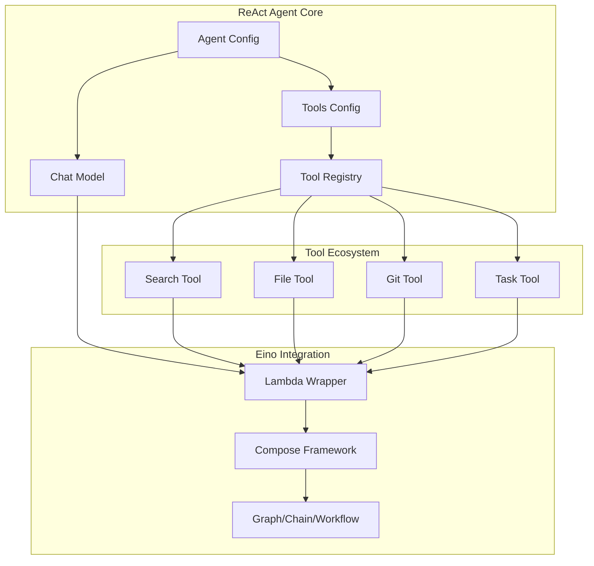

# ReAct 模式核心概念详解

*基于 Eino 框架的实现分析*

---

## 🧠 ReAct 模式理论概念

### 什么是 ReAct？

**ReAct** = **Re**asoning + **Act**ing，是一种让 AI 代理能够进行**推理-行动循环**的框架模式。它模拟了人类解决问题的思维方式：

1. **推理（Reasoning）**：分析问题，制定行动计划
2. **行动（Acting）**：执行具体的工具调用
3. **观察（Observing）**：获取行动结果

> **💡 注记**：ReAct 的**标准循环**是 **Thought→Action→Observation**。本文中后续提及的"反思"属于工程化增强策略（可借鉴 Reflexion/Self-Refine 等方法），**并非** ReAct 论文的必备环节。([arXiv:2210.03629](https://arxiv.org/abs/2210.03629))

### 核心思想

ReAct 模式解决了传统 AI 系统的几个关键限制：
- **静态知识限制** - 通过工具调用获取实时信息
- **单一交互模式** - 支持复杂的多步骤任务
- **被动响应机制** - 主动分析和解决问题的能力

---

## 🔄 推理-行动循环机制

### 循环结构图



### Eino 实现中的循环控制

从 `flow.go` 的 `reactAgentLambda` 函数可以看到核心配置：

```go
config := &react.AgentConfig{
    MaxStep:            25,        // 最大循环25步
    ToolReturnDirectly: map[string]struct{}{}
}
```

**关键参数说明**：
- `MaxStep: 25` - 防止无限循环的安全机制（本示例设置为 25，框架默认值为 12）
- `ToolReturnDirectly` - 控制哪些工具直接返回结果（当工具被调用时直接返回，不继续循环）

### 循环执行流程

1. **接收输入** - 获取用户的查询或任务
2. **分析推理** - LLM 分析问题，制定解决方案
3. **工具决策** - 判断是否需要调用外部工具
4. **执行行动** - 如果需要，选择并执行合适的工具
5. **结果观察** - 获取工具执行的结果
6. **反思评估** - 基于结果判断是否需要继续
7. **循环控制** - 根据评估结果决定是否继续循环

---

## 🛠️ 工具调用和决策机制

### 工具注册系统

从 `tools_node.go` 的 `GetTools` 函数可以看到工具集成机制：

```go
func GetTools(ctx context.Context) ([]tool.BaseTool, error) {
    // 创建各种工具实例
    einoAssistantTool, err := NewEinoAssistantTool(ctx)
    toolTask, err := NewTaskTool(ctx)
    toolOpen, err := NewOpenFileTool(ctx)
    toolGitClone, err := NewGitCloneFile(ctx)
    toolDDGSearch, err := NewDDGSearch(ctx, nil)

    return []tool.BaseTool{
        einoAssistantTool,
        toolTask,
        toolOpen,
        toolGitClone,
        toolDDGSearch,
    }, nil
}
```

### 可用工具类型

| 工具名称 | 功能描述 | 使用场景 | 来源说明 |
|----------|----------|----------|----------|
| **EinoAssistantTool** | Eino 助手功能 | 框架相关查询和帮助 | 示例/自研工具 |
| **TaskTool** | 任务管理工具 | 任务创建、跟踪、管理 | 官方示例工具 |
| **OpenFileTool** | 文件/URL 打开工具 | 本地文件访问、网页浏览 | 示例/自研工具 |
| **GitCloneTool** | Git 仓库克隆工具 | 代码仓库下载、版本管理 | 官方示例工具 |
| **DDGSearchTool** | DuckDuckGo 搜索工具 | 网络信息搜索、实时查询 | 官方扩展工具 |

### 决策机制流程

Agent 的决策流程：

1. **意图分析**
   ```go
   // LLM 分析用户输入，识别所需工具类型
   input := "今天北京的天气怎么样？"
   // 分析结果：需要天气信息 → 选择搜索工具
   ```

2. **工具选择**
   ```go
   // 从可用工具中选择最合适的工具
   selectedTool := "DDGSearchTool"
   ```

3. **参数构建**
   ```go
   // 为工具准备正确的参数
   params := map[string]interface{}{
       "query": "北京今天天气",
   }
   ```

4. **执行调用**
   ```go
   // 运行工具并获取结果
   result, err := selectedTool.Invoke(ctx, params)
   ```

5. **结果处理**
   ```go
   // 解析工具返回的结果
   weatherInfo := parseWeatherResult(result)
   ```

---

## 🏗️ Eino ReAct Agent 架构分析

### 组件组成

```go
// flow.go 的核心实现
func reactAgentLambda(ctx context.Context) (lba *compose.Lambda, err error) {
    // 1. 配置 ReAct Agent
    config := &react.AgentConfig{
        MaxStep:            25,
        ToolReturnDirectly: map[string]struct{}{}
    }

    // 2. 设置 ChatModel
    chatModelIns11, err := newChatModel(ctx)
    if err != nil {
        return nil, err
    }
    config.Model = chatModelIns11

    // 3. 集成工具集
    tools, err := GetTools(ctx)
    if err != nil {
        return nil, err
    }
    config.ToolsConfig.Tools = tools

    // 4. 创建 Agent 实例
    ins, err := react.NewAgent(ctx, config)
    if err != nil {
        return nil, err
    }

    // 5. 包装为 Lambda 组件
    lba, err = compose.AnyLambda(ins.Generate, ins.Stream, nil, nil)
    if err != nil {
        return nil, err
    }
    return lba, nil
}
```

### 架构特点

#### 1. **模块化设计**
- **模型独立** - ChatModel 可以是任何兼容的 LLM
- **工具独立** - 工具系统独立于 Agent 逻辑
- **配置驱动** - 通过配置文件控制行为

#### 2. **Lambda 包装**
```go
lba, err := compose.AnyLambda(ins.Generate, ins.Stream, nil, nil)
```
- 将 Agent 包装为可组合的 Lambda 组件
- 支持同步（Generate）和异步（Stream）两种模式
- 便于与其他 Eino 组件集成

#### 3. **上下文传递**
```go
func reactAgentLambda(ctx context.Context) (*compose.Lambda, error)
```
- 完整的 `context.Context` 支持
- 支持取消、超时、值传递等特性
- 符合 Go 语言最佳实践

### 系统架构图



---

## 🎯 ReAct 模式的关键特性

### 1. **智能决策能力**

#### 自主选择
- Agent 能根据问题自动选择合适的工具
- 基于上下文理解进行智能决策
- 支持多工具组合使用

#### 动态调整
- 基于执行结果调整后续策略
- **注意**：错误恢复需要工具层支持，默认行为是遇错即停
- 适应性学习优化（可通过自定义编排实现）

#### 多步推理
- 支持复杂的多步骤问题解决
- 状态维护和上下文管理
- 长期规划和执行能力

### 2. **工具生态系统**

#### 统一接口
```go
// BaseTool 获取工具信息用于 ChatModel 意图识别
type BaseTool interface {
    Info(ctx context.Context) (*schema.ToolInfo, error)
}

// InvokableTool 用于 ChatModel 意图识别和 ToolsNode 执行
type InvokableTool interface {
    BaseTool
    InvokableRun(ctx context.Context, argumentsInJSON string, opts ...Option) (string, error)
}

// StreamableTool 流式工具接口
type StreamableTool interface {
    BaseTool
    StreamableRun(ctx context.Context, argumentsInJSON string, opts ...Option) (*schema.StreamReader[string], error)
}
```
- 所有工具都实现 `tool.BaseTool` 接口（提供工具信息）
- 可调用工具实现 `InvokableTool` 接口（同步执行）
- 流式工具实现 `StreamableTool` 接口（流式执行）
- 标准化的调用方式和一致的错误处理机制

#### 类型安全
- 强类型的参数和返回值
- 编译时类型检查
- 减少运行时错误

#### 错误处理
- **重要**：Eino ReAct Agent **默认遇到工具调用错误会直接退出**，不会自动恢复/重试
- 要实现"恢复/重试"机制，需要在工具层将错误**转为文本响应**返回给模型
- 可通过工具封装（如 `SafeInferTool` 模式）或自定义编排实现错误容忍
- 支持超时控制和自定义错误处理策略

### 3. **可扩展架构**

#### 工具插件化
```go
// 新工具可以轻松集成
func NewCustomTool(ctx context.Context, config *CustomConfig) (tool.BaseTool, error) {
    return &CustomTool{config: config}, nil
}
```
- 新工具可以轻松集成
- 动态工具加载机制
- 热插拔支持

#### 配置灵活
```go
config := &react.AgentConfig{
    // 推荐使用 ToolCallingModel（支持工具调用的模型）
    ToolCallingModel:   myToolCallingModel,
    // 或使用传统的 Model 字段（已弃用）
    Model:              myChatModel,
    // 工具配置
    ToolsConfig:        compose.ToolsNodeConfig{Tools: tools},
    // 最大步数限制
    MaxStep:            25,
    // 直接返回结果的工具列表
    ToolReturnDirectly: map[string]struct{}{"fast_tool": {}},
    // 消息修改器（可选）
    MessageModifier:    myMessageModifier,
    // 流式输出工具调用检查器（可选）
    StreamToolCallChecker: myStreamChecker,
    // 自定义节点名称（可选）
    GraphName:          "MyReActAgent",
    ModelNodeName:      "ChatModel",
    ToolsNodeName:      "Tools",
}
```
- 支持动态配置和运行时调整
- 细粒度的行为控制
- 环境适应性配置
- 支持工具调用模型和传统聊天模型

#### 组合能力
- 可以与其他 Eino 组件组合使用
- 支持 Graph、Chain、Workflow 等编排模式
- 灵活的系统集成方案

### 4. **安全性保障**

#### 步数限制
```go
MaxStep: 25  // 防止无限循环
```
- 防止无限循环的安全机制
- 资源使用控制
- 避免系统过载

#### 权限控制
- 工具访问权限可配置
- 安全沙箱执行环境
- 敏感操作审计

#### 状态管理
- 完整的执行状态跟踪
- 中间结果缓存
- 故障恢复支持

---

## 🚀 实际应用示例

### 简单任务示例：天气查询

**用户输入**："今天北京的天气怎么样？"

```
Step 1 - 推理: 用户需要天气信息，我需要搜索工具
Step 2 - 行动: 调用 DuckDuckGo 搜索工具
         params: {"query": "北京今天天气"}
Step 3 - 观察: 获得搜索结果，包含天气信息
         result: "北京今天晴，气温 15-25°C，微风"
Step 4 - 反思: 信息足够，可以回答用户
Step 5 - 输出: "根据搜索结果，北京今天天气晴朗，气温15-25摄氏度，有微风，适合外出活动。"
```

### 复杂任务示例：项目分析

**用户输入**："帮我克隆 https://github.com/user/repo.git 并分析其结构"

```
Step 1: 分析需求
       - 需要Git克隆工具获取代码
       - 需要文件分析工具查看结构
       - 可能需要搜索工具了解项目背景

Step 2: 克隆项目
       - 工具: GitCloneTool
       - 参数: {"url": "https://github.com/user/repo.git", "path": "/tmp/repo"}

Step 3: 查看目录结构
       - 工具: OpenFileTool
       - 参数: {"path": "/tmp/repo"}

Step 4: 分析重要文件
       - 依次查看 README.md, package.json, main.go 等
       - 提取项目信息、依赖关系、架构特点

Step 5: 生成分析报告
       - 总结项目特点
       - 分析技术栈
       - 提供项目结构概览
```

### 多工具协作示例：旅行规划

**用户输入**："帮我规划下周末去上海的旅行"

```
Step 1: 需求分析
       - 需要查询天气信息
       - 需要搜索景点推荐
       - 需要查找交通方式
       - 需要了解住宿选择

Step 2: 天气查询
       - 工具: DDGSearchTool
       - 查询: "上海下周末天气预报"

Step 3: 景点搜索
       - 工具: DDGSearchTool
       - 查询: "上海热门旅游景点推荐"

Step 4: 交通信息
       - 工具: DDGSearchTool
       - 查询: "到上海的交通方式 高铁飞机"

Step 5: 住宿搜索
       - 工具: DDGSearchTool
       - 查询: "上海酒店推荐 性价比"

Step 6: 综合规划
       - 整合所有信息
       - 生成详细行程建议
```

---

## 📈 与传统模式对比

### 功能对比表

| 特性 | 传统对话系统 | ReAct Agent |
|------|-------------|-------------|
| **交互模式** | 一次性问答 | 多轮对话+行动 |
| **能力范围** | 纯文本生成 | 文本+工具调用 |
| **信息来源** | 预训练知识 | 实时信息获取 |
| **任务处理** | 简单问答 | 复杂多步任务 |
| **准确性** | 受限于训练数据 | 可获取最新信息 |
| **可扩展性** | 需要重新训练 | 插件化扩展 |
| **自主性** | 被动响应 | 主动解决问题 |

### 应用场景对比

#### 传统对话系统适合：
- 简单问答
- 创意写作
- 知识解释
- 语言翻译

#### ReAct Agent 适合：
- 信息检索
- 数据分析
- 任务自动化
- 决策支持
- 实时查询
- 复杂问题解决

---

## 🔧 实现精髓与最佳实践

### 架构设计原则

#### 1. **关注点分离**
```go
// 推理逻辑、工具调用、结果处理各司其职
// 注意：这是概念性示例，实际 ReAct Agent 的内部结构由框架管理
// 用户通过 AgentConfig 进行配置
type AgentConfig struct {
    ToolCallingModel model.ToolCallingChatModel  // 推理核心（推荐）
    Model            model.ChatModel             // 传统模型（已弃用）
    ToolsConfig      compose.ToolsNodeConfig     // 工具配置
    MaxStep          int                         // 循环控制
    // ... 其他配置字段
}
```

#### 2. **接口抽象**
```go
// 统一的工具接口便于扩展
type BaseTool interface {
    Info(ctx context.Context) (*schema.ToolInfo, error)
}

type InvokableTool interface {
    BaseTool
    InvokableRun(ctx context.Context, argumentsInJSON string, opts ...Option) (string, error)
}
```

#### 3. **配置驱动**
```go
// 通过配置控制行为，而非硬编码
type AgentConfig struct {
    ToolCallingModel      model.ToolCallingChatModel
    Model                 model.ChatModel
    ToolsConfig           compose.ToolsNodeConfig
    MaxStep               int
    ToolReturnDirectly    map[string]struct{}
    MessageModifier       MessageModifier
    StreamToolCallChecker func(context.Context, *schema.StreamReader[*schema.Message]) (bool, error)
    // ... 其他配置字段
}
```

#### 4. **组合优于继承**
```go
// 通过组合不同组件构建复杂系统
lba, err := compose.AnyLambda(ins.Generate, ins.Stream, nil, nil)
```

### 开发最佳实践

#### 1. **错误处理**
```go
// 完善的错误处理机制示例
func executeToolSafely(ctx context.Context, tool tool.InvokableTool, argumentsJSON string) (string, error) {
    result, err := tool.InvokableRun(ctx, argumentsJSON)
    if err != nil {
        // 记录错误日志
        log.Printf("工具执行失败: %v", err)
        // 返回用户友好的错误信息
        return "", fmt.Errorf("工具执行失败: %w", err)
    }
    return result, nil
}
```

#### 2. **资源管理**
```go
// 使用 context 控制生命周期示例
func runAgentWithTimeout(ctx context.Context, agent *react.Agent, messages []*schema.Message) (*schema.Message, error) {
    // 设置超时
    ctx, cancel := context.WithTimeout(ctx, 30*time.Second)
    defer cancel()

    // 执行 Agent
    return agent.Generate(ctx, messages)
}
```

#### 3. **日志记录**
```go
// 详细的执行日志示例
// 注意：Eino 框架通过 callbacks 机制提供日志和追踪功能
// 用户可以通过 WithCallbacks 选项注入自定义回调
func logAgentExecution(ctx context.Context, agent *react.Agent, messages []*schema.Message) (*schema.Message, error) {
    // 使用 callbacks 进行日志记录
    result, err := agent.Generate(ctx, messages, 
        agent.WithCallbacks(myCustomCallback))
    if err != nil {
        log.Printf("Agent 执行失败: %v", err)
        return nil, err
    }
    log.Printf("Agent 执行成功")
    return result, nil
}
```

#### 4. **测试策略**
```go
// 单元测试每个组件示例
func TestReactAgent_WeatherQuery(t *testing.T) {
    ctx := context.Background()
    
    // 创建测试用的 Agent
    config := &react.AgentConfig{
        Model:   createMockChatModel(),
        MaxStep: 10,
    }
    config.ToolsConfig.Tools = []tool.BaseTool{createMockSearchTool()}
    
    agent, err := react.NewAgent(ctx, config)
    require.NoError(t, err)
    
    // 执行测试
    messages := []*schema.Message{
        schema.UserMessage("今天北京天气如何？"),
    }
    result, err := agent.Generate(ctx, messages)
    
    assert.NoError(t, err)
    assert.NotNil(t, result)
    assert.Contains(t, result.Content, "北京")
}
```

---

## 🎓 学习要点总结

### 核心概念理解

通过 Eino 框架的实现，ReAct 模式展现了以下核心价值：

#### 🎯 关键洞察

1. **智能化**
   - Agent 不只是被动响应，而是主动思考和决策
   - 具备类似人类的问题解决能力
   - 可以处理复杂的多步骤任务

2. **工具化**
   - 将复杂功能封装为可复用的工具组件
   - 标准化的接口设计便于扩展
   - 插件化架构支持灵活定制

3. **结构化**
   - 通过配置驱动的方式实现灵活的控制
   - 清晰的架构分层和职责划分
   - 便于维护和调试

4. **安全性**
   - 内置的保护机制确保系统稳定运行
   - 完善的错误处理和恢复策略
   - 资源使用控制和监控

### 技术实现要点

#### 1. **循环控制**
- 安全的循环终止机制
- 状态管理和上下文维护
- 异常情况的处理策略

#### 2. **工具集成**
- 统一的工具接口规范
- 动态工具发现和加载
- 工具调用的参数验证

#### 3. **决策算法**
- 基于上下文的智能选择
- 多目标优化策略
- 学习和适应能力

#### 4. **系统设计**
- 模块化和可扩展性
- 高性能和低延迟
- 监控和可观测性

### 实际应用价值

#### 1. **企业级应用**
- 自动化客服系统
- 智能运维助手
- 数据分析平台

#### 2. **开发工具**
- 代码生成和优化
- 自动化测试
- 文档生成

#### 3. **个人助理**
- 信息检索助手
- 任务管理工具
- 学习辅助系统

### 未来发展方向

#### 1. **多模态支持**
- 图像、音频、视频处理
- 跨模态理解和生成
- 多媒体内容创作

#### 2. **分布式协作**
- 多 Agent 协同工作
- 任务分解和并行处理
- 分布式决策机制

#### 3. **自学习能力**
- 从经验中学习优化
- 个性化适应能力
- 知识积累和共享

---

## 📚 版本说明与参考资料

### 版本信息
- **本文档基于**：Eino 框架 **v0.5.0**（2025-09-09 正式发布）
- **当前最新**：建议以 **v0.5.x** 系列为准（截至 2025-01-19 最新为 v0.5.7）
- **兼容性**：本文档内容适用于 v0.5.x 系列，API 基本向后兼容

### 工具来源说明
- **官方标准工具**：DuckDuckGoSearch（无需 API Key）
- **官方示例工具**：GitClone、Task（在 eino-examples 仓库中提供）
- **示例/自研工具**：EinoAssistantTool、OpenFileTool（本文档示例中的自定义工具）

### 官方文档
- [Eino Framework GitHub](https://github.com/cloudwego/eino)
- [Eino Examples](https://github.com/cloudwego/eino-examples)
- [ReAct Agent Manual](https://www.cloudwego.io/docs/eino/core_modules/flow_integration_components/react_agent_manual/)
- [ToolsNode Guide](https://www.cloudwego.io/docs/eino/core_modules/components/tools_node_guide/)

### 学术参考
- [ReAct Paper](https://arxiv.org/abs/2210.03629) - Yao et al. (2022)
- [Reflexion Paper](https://arxiv.org/abs/2303.11366) - Shinn et al. (2023)

### 相关技术
- [LangChain Agents](https://python.langchain.com/docs/modules/agents/)
- [AutoGPT](https://github.com/Significant-Gravitas/AutoGPT)
- [BabyAGI](https://github.com/yoheinakajima/babyagi)

---

*⚠️ **重要勘误说明**：本文档已根据专业反馈进行修正，主要涉及 ReAct 循环定义（移除"反思"作为必备环节）和 Eino 错误处理机制（默认遇错即停）的准确描述。*