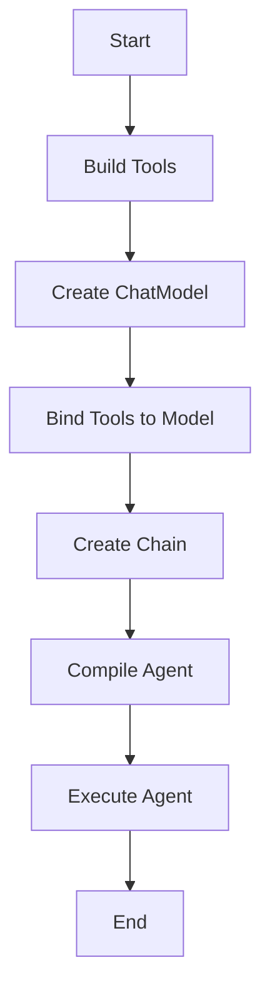

## 说明

本示例展示了如何用 Eino 快速搭建一个具备“工具调用（Tool Calling）”能力的 Todo Agent。核心演示点：

- **三种工具实现方式**：
  - `utils.NewTool` 方式（`add_todo`）。
  - `utils.InferTool` 从函数签名推断参数（`update_todo`）。
  - 自定义实现 `tool.InvokableTool` 接口（`list_todo`）。
- **与聊天模型绑定工具**：`chatModel.BindTools(toolInfos)`。
- **编排链式流程**：`compose.NewChain` + `ToolsNode`。
- **内置搜索工具集成**：DuckDuckGo 文本搜索。
- **可观测集成（可选）**：CozeLoop 回调链路追踪。

源码位置：`quickstart/todoagent/main.go`

---

### 环境变量

本示例默认使用 OpenAI 接入（也可指向兼容 OpenAI 的网关）：


在 `quickstart/todoagent/` 目录下执行：

```bash
go run main.go
```
程序会构建一条包含聊天模型与工具节点的链式流程，并以一条示例用户消息启动：

> “添加一个学习 Eino 的 TODO，同时搜索一下 cloudwego/eino 的仓库地址”

控制台将输出模型与工具交互后的消息列表。

---
### 执行流程图（main）


---
### 交互效果（示例）

程序启动后会：

- 调用 `add_todo` 工具添加一条学习任务。
- 通过 DuckDuckGo 搜索 `cloudwego/eino` 仓库地址并在回复中给出。
- 打印类似如下日志：

```text
message 0: assistant: ...
message 1: tool: {"msg":"add todo success"}
message 2: assistant: ...（包含搜索到的仓库链接）
```
> 提示：`list_todo` 在示例中仅返回内置的演示 JSON，未接入真实存储，请按需扩展。

- **工具的三种实现方式**
  - `add_todo`：使用 `utils.NewTool` 显式声明 `schema.ToolInfo` 与参数结构（`ParamsOneOf`）。对应实现函数 `AddTodoFunc(params *TodoAddParams)`。
  - `update_todo`：使用 `utils.InferTool("update_todo", ..., UpdateTodoFunc)` 根据 Go 函数签名和参数结构体 `TodoUpdateParams` 自动推断工具参数（依赖 `json` 与 `jsonschema` tag）。
  - `list_todo`：自定义结构体 `ListTodoTool`，实现 `Info(ctx)` 与 `InvokableRun(ctx, argumentsInJSON, ...)`，完全掌控元信息与执行逻辑。

- **DuckDuckGo 搜索工具**
  - `duckduckgo.NewTextSearchTool(ctx, &duckduckgo.Config{})` 返回 `tool.BaseTool`，可与模型协同完成网页检索。

- **绑定工具到聊天模型**
  - 先收集 `ToolInfo`：`todoTool.Info(ctx)`。
  - 绑定：`chatModel.BindTools(toolInfos)`。
  - 大模型使用 `eino-ext` 的 OpenAI 适配：`openai.NewChatModel(...)`。

- **链式编排（Chain + ToolsNode）**
  - `compose.NewToolNode(ctx, &compose.ToolsNodeConfig{ Tools: todoTools })` 创建工具节点。
  - `compose.NewChain[[]*schema.Message, []*schema.Message]()` 创建链。
  - 依次 `AppendChatModel(...).AppendToolsNode(...)`，再 `Compile(ctx)` 得到可执行的 `agent`。

- **调用与消息结构**
  - 使用 `agent.Invoke(ctx, []*schema.Message{ ... })` 传入对话轮。
  - 消息类型为 `schema.Message`，包含 `Role` 与 `Content`。

---

## 常见扩展与练习

- **接入真实数据层**：将 `add_todo`、`update_todo`、`list_todo` 接入数据库或本地文件，落地真实的 Todo 管理。
- **完善工具 schema**：在 `ParamsOneOf` 与结构体 tag 中补充更丰富的参数与约束，提升函数调用质量。
- **新增工具**：如“删除 Todo”“按照日期过滤”“导出为 Markdown”等，感受工具生态扩展的便捷性。
- **替换大模型提供方**：将 `OPENAI_BASE_URL` 指向自建或第三方兼容网关，或替换为其他 `eino-ext` 已支持的模型实现。
- **增强可观测**：结合更多回调与链路追踪，定位与优化工具调用质量。

---

## 故障排查

- **BindTools/ToolInfo 报错**：检查工具的 `Info(ctx)` 是否返回合法 `ToolInfo`，`ParamsOneOf` 是否完整，`json/jsonschema` tag 是否正确。
- **InferTool 参数不生效**：
  - 确认函数参数是结构体指针（如 `*TodoUpdateParams`）。
  - 字段包含 `json` 与（可选）`jsonschema` 注解，类型与必填性清晰。
- **请求失败或无响应**：
  - 检查 `OPENAI_*` 环境变量与网络连通性。
  - 若自建网关，确认 `OPENAI_BASE_URL` 路径正确（通常以 `/v1` 结尾）。
- **DuckDuckGo 搜索失败**：
  - 多为网络问题或频率限制，重试或更换网络环境。
- **CozeLoop 未生效**：
  - 确保 `COZELOOP_API_TOKEN` 与 `COZELOOP_WORKSPACE_ID` 均已设置且可用。

---

## 参考

- Eino 文档与实践：https://www.cloudwego.io/zh/docs/eino/
- `openai` 组件（eino-ext）：https://github.com/cloudwego/eino-ext
- DuckDuckGo 工具（eino-ext）：`github.com/cloudwego/eino-ext/components/tool/duckduckgo/v2`
- 函数式工具推断（可参考实现）：`components/tool/utils.InferTool`
